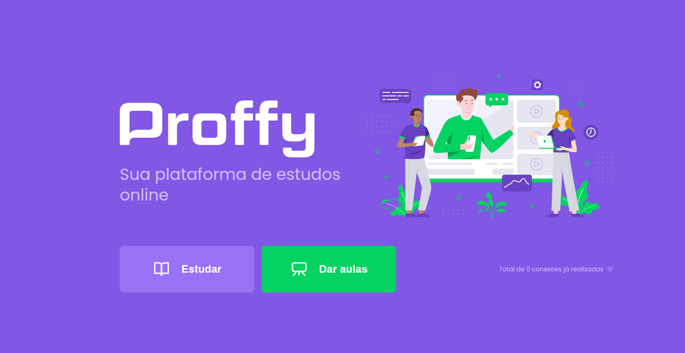

<h1>
    
</h1>

# Indice

- [Sobre](#-sobre)
- [Como baixar o projeto](#-como-baixar-o-projeto)

## 🔖&nbsp; Sobre

Projeto desenvolvido durante a Next Level Week 2, da @Rocketseat.

---

---

## 🗂 Como baixar o projeto

```bash

    # Clonar o repositório
    $ git clone https://github.com/danileao/nlw2

    # Entrar no diretório desejado
    $ cd web
    ou
    $ cd mobile
    ou
    $ cd server

    # Instalar as dependências
    $ yarn install

    # Iniciar o projeto
    $ yarn start
```

---

Desenvolvido 💜 por Daniele Leão Evangelista

<p>
<a href="https://www.youtube.com/danieleleaoevangelista">

</a> &nbsp; &nbsp;

<a href="https://www.instagram.com/dani_leao/">

</a> &nbsp; &nbsp;

<a href="https://twitter.com/danieleleao">

</a> &nbsp; &nbsp;

<a href="https://www.linkedin.com/in/daniele-leão-evangelista-5540ab25/">
 &nbsp;
</a>

</p>
